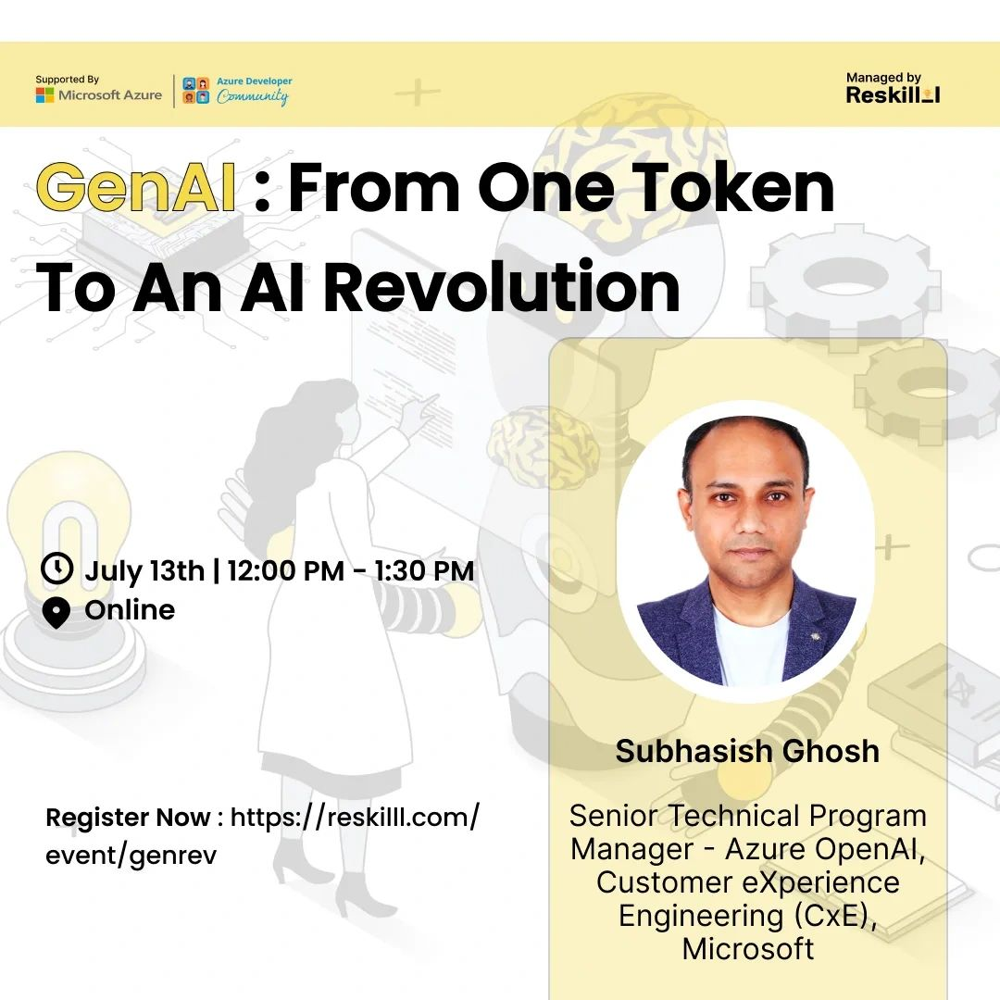

# GenAI: From One Token To An AI Revolution
Online Webinar, July 13 2024  
// Organized in association with Microsoft Azure & Microsoft Azure Developer Community (ADC), Dehradun

## About:
Embark on an enlightening journey through the evolution of Generative AI, exploring its humble beginnings from the concept of a single token to its transformative impact on modern technology and society. This session will delve into the core principles of generative models, their applications across various industries, and the revolutionary advancements they have spurred. Participants will gain a deeper understanding of how generative AI works, its potential to drive innovation, and the ethical considerations surrounding its development and deployment. Whether you're a novice or an AI enthusiast, this session will provide valuable insights into the past, present, and future of generative AI.

## Speaker:
Subhasish Ghosh  
Senior Technical Program Manager - Azure OpenAI Service,  
Customer eXperience Engineering (CxE),  
Azure AI Platform,  
Microsoft

## Agenda:
✅ Generative AI concepts  
✅ Tokenization  
✅ Transformers  
✅ Foundation Models & associated concepts  
✅ Azure OpenAI Service Models  
✅ Top3 Microsoft Build 2024 AI Announcements  
✅ Case Studies  
✅ Demos (wherein we explore OpenAI Python SDK + Semantic Kernel SDK using C#)  
✅ Quiz  

📅 Date: July 13th
🕒 Time: 12:00 PM - 1:30 PM
📍 Online
🔗 Registration Link: https://lnkd.in/gUq4FwhW

## Code showcased in demos:
GitHub repo for OpenAI Python SDK code &amp; Semantic Kernel C# code Demos for Webinar

## Watch recording of Webinar here:
Link > 

If you have any questions, am reachable on: sugh AT microsoft DOT com
